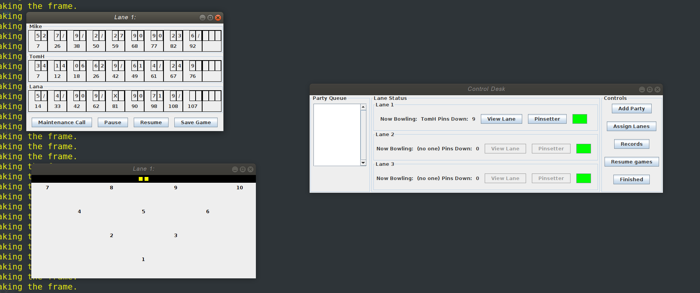

# Bowling Game
The app simulates a Bowling lane. Parties can be added on the queue to bowl, they get scheduled on the lanes. The state of the lanes, and the bowling pins are shown for every frame. All this happens parallely on separate threads.

As the starting point of the project, the full working code was available. Through this project, we have only refactored the code to improve metrics and improve maintainibility. Play/Pause, Increasing limit of persons per party, and Statisitics Query window were new features implemented by us. Reports describing the refactored part and new features part is present in doc folder.

# Run
* `javac drive.java`                                
* `java drive`

# File Structure
* `src/`: Contains all source files.                                   
* `doc/`: Contains report files.
